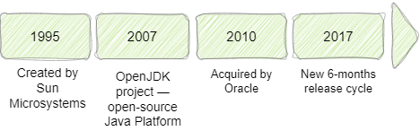

Java is a high-level programming language, currently ranking among the most popular choices in the field. Its applications span from web development to mobile applications and top-tier enterprise systems. Continuously evolving, Java remains at the forefront of technological advancement. Embark with us on the journey to study Java!

## Java history

Java appeared in the computing world in the mid-1990s. It was created by Sun Microsystems as a new kind of programming language meant to make strong and flexible software that could work on any device. Developed by a team led by James Gosling and initially named "Oak," Java underwent a transformation to meet the needs of the digital era. With its promise of "write once, run anywhere" capability, Java quickly gained popularity among developers seeking to escape the constraints of platform-specific languages.

Java officially launched in 1995 and quickly became very common. It was different from other programming languages because it managed memory automatically and could run on any device or operating system with the right software. This made it easier for developers to write programs that worked everywhere.

In 2010, Oracle Corporation bought Sun Microsystems and took over Java. Oracle made some changes to Java, but there were also some arguments over who owned certain parts of the technology.

Despite these controversies, Oracle made Java more flexible by releasing updates more often, every six months. They also started to listen more to the Java community, which helped improve the language. This accelerated pace of development aimed to provide developers with more frequent updates, bug fixes, and feature enhancements, ensuring Java's relevance in the ever-changing technology landscape.

Even though there are newer languages and tools available, Java is still widely used in software development. It's liked because it suits projects of any size and is supported by a wide variety of useful tools. Big companies like Microsoft, Netflix, Ebay, Uber, and PayPal all use Java for their software.

## Java advantages

Let's now mention some advantages of Java language. It's totally ok if you don't understand any of them now, because we will spend a lot of time talking about these pints later in the course.

1. Platform Independence: Java programs can work on any kind of computer thanks to the software called the Java Virtual Machine (JVM). You don't have to develop different versions of program, as it is with C and C++.
2. Automatic Memory Management: Java helps manage memory automatically, which means developers don't need to worry about it. This makes programming easier and reduces the chances of mistakes.
3. High Performance: Java is designed to be fast and efficient, making it great for tasks that need a lot of computing power.
4. Security Features: Java comes with built-in security features to protect against common problems to mitigate common vulnerabilities, ensuring the development of secure software solutions.
5. Multi-Paradigm Support: Java can be used in different ways depending on how you like to write code - it supports object-oriented, imperative, and functional programming.
6. Scalability and Reliability: Java is reliable and can handle big projects with lots of users and data. This makes it a good choice for businesses and developers who need to build large-scale applications.
