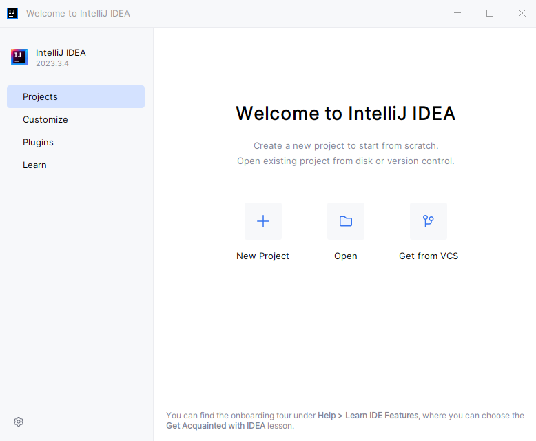
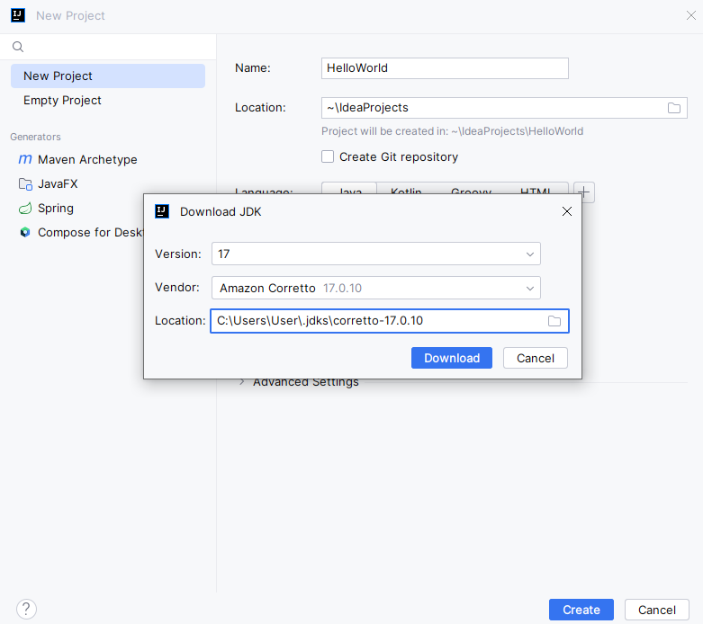
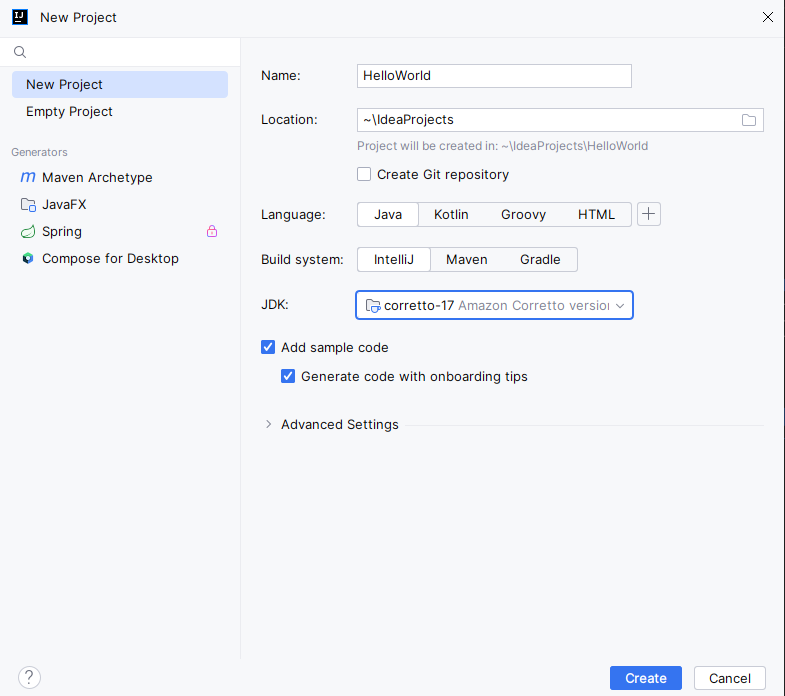
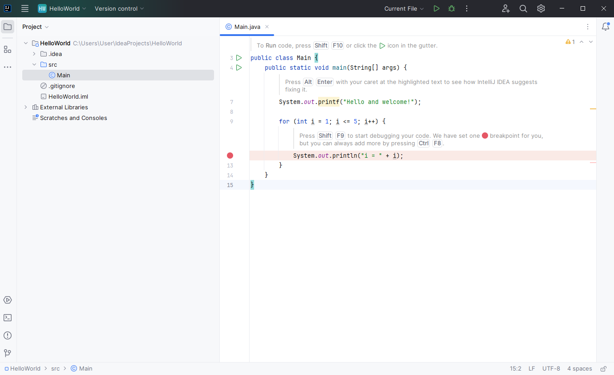
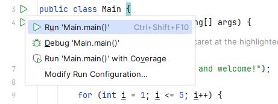
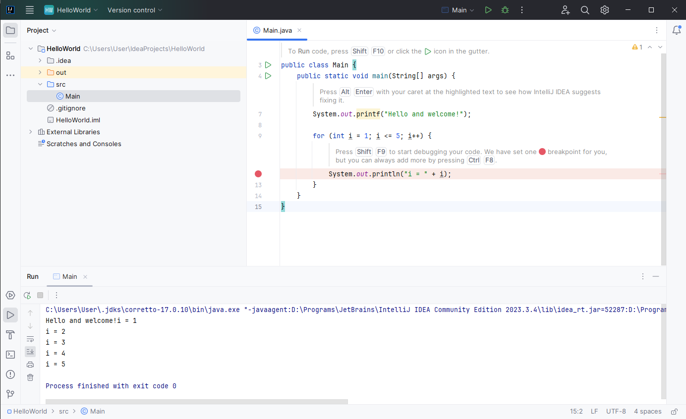
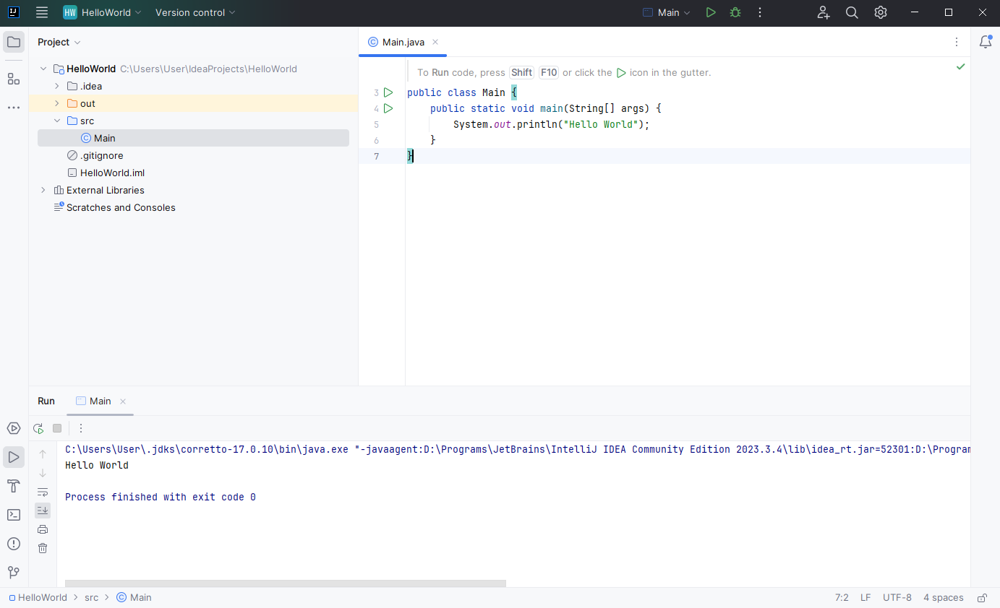

## Setup

For this course, you will need to download and setup git, IDE and JDK.

Git is a distributed version control system used for tracking changes in source code during software development. It enables collaboration among developers by allowing them to work on the same codebase simultaneously, manage different versions, and merge changes seamlessly while preserving the project's history. Git setup is pretty straightforward - go to the official website (https://git-scm.com/downloads) and download the version for your OS. When the installer is downloaded, launch it and go through the setup wizard. When the git is installed, you should be able to see a new "Git Bash" application.

JDK, or Java Development Kit, is a bundle of software tools for developing Java applications. It includes the Java compiler, debugger, and the standard libraries.

An Integrated Development Environment (IDE) is a software that provides tools to facilitate software development. Basically it's a program where you write, lauch and debug your code. For your course, you have the flexibility to choose any IDE, but currently, IntelliJ IDEA stands out as the standard choice. If you select another IDE, you will have to also install JDK yourself.

Here's how you can install Intellij:
1. **Visit the IntelliJ IDEA Website**: https://www.jetbrains.com/idea/. Then locate the "Download" button and click on it. You will be directed to the download page.
2. **Select Community Version**: On the download page, you'll find different versions of IntelliJ IDEA, including the Community (free) and Ultimate (paid) versions. For this course, it's recommended to select the Community version as it provides all the essential features without any cost. Click on the "Download" button next to the Community version.
3. **Wait for the Download to Complete**: Depending on your internet connection speed, the download process may take some time.
4. **Install IntelliJ IDEA**: Once the download is complete, locate the downloaded installer on your computer and launch it. Follow the on-screen instructions provided by the installer to proceed with the installation. When prompted to select the installation location, choose a folder that suits your preferences.

Now let's setup JDK and create our first program. Launch IntelliJ, you should see the screen like that:



Press "New Project" button. You will see a new project window. Select the option "SDK" and choose download new. The JDK's version should be 17, vendor - Anazon Coretto. On the following screen the full version is 17.0.10, it's ok if you have another minor version. For the location choose any folder that suits you.



Click download, and wait for the JDK to be downloaded. Then populate other fields in a window. Name - "HelloWorld", location - any of your choice, language - Java, build system - IntelliJ.



Then press a button create. It will take some time, but finally you should see the following window:



There are a lot of things there, but don't be afraid. For now, the main section is to the right, where you can write and run your code. Let's first run the code, that IntelliJ created for us. For that, press a green triangle (any of two), and select `Run 'Main.main()'`



A new section should appear on the bottom, with the similar text as on screen:



Let's now replace the code in editor with

```
public class Main {
  public static void main(String[] args) {
    System.out.println("Hello World");
  }
}
``` 

When you run this code, you should see the message `Hello World` in console. Congratulations!


